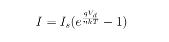
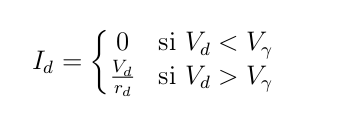

\usepackage[T1]{fontenc}
\usepackage[utf8]{inputenc}
## aa
### Objetivos
Obtener la relación entre la caída de tensión y la corriente en un diodo, así como su comportamiento en un circuito sencillo.

### Fundamentos teóricos
El **diodo** es un dispositivo electrónico cuya relación I-V es la siguiente:

I: La intensidad de la corriente que atraviesa el diodo y V d la diferencia de tensión entre sus extremos.

• I s : La corriente de saturación inversa.
• q: La carga del electrón (1.6×10 −19 C).
• T: La temperatura de la unión (expresada en grados Kelvin).
• k: La constante de Boltzmann (k=1.38×10 −23 J/K).
• n: El  índice de idealidad, que suele adoptar valores entre 1 (para el germanio) y del orden de 2 (para el silicio).
Dicha relación, al ser de tipo exponencial, hace más complicado la resolución de los circuitos. Por consiguiente, con el propósito de simplificar el cálculo, se usan modelos sencillos que dan una idea aproximada del funcionamiento del diodo pero sin usar la relación exponencial. Uno de estos modelos es el siguiente:

### Material
### Desarrrollo y resultados
### Discusión
### Conclusión 